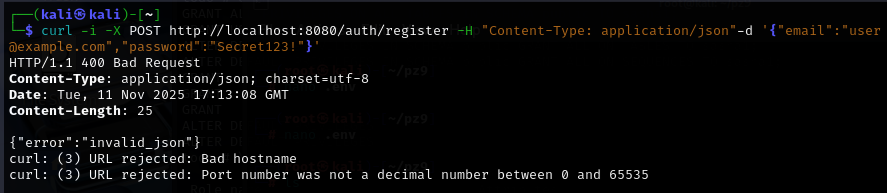
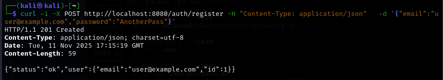
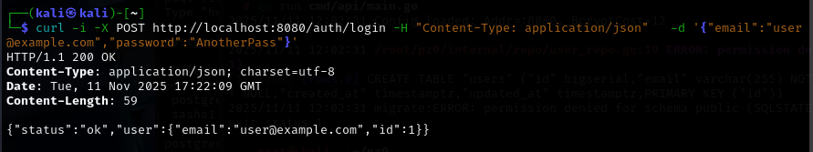
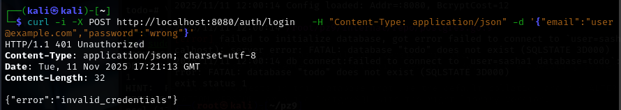

## практическа работа 9

### ЭФМО-02-25 Фомичев Александр Сергеевич

#### Структура проекта
```
pz9-auth/
  cmd/api/main.go
  internal/http/handlers/auth.go
  internal/core/user.go
  internal/repo/postgres.go
  internal/repo/user_repo.go
  internal/platform/config/config.go
  go.mod
          
```
### Цели:
1) Научиться безопасно хранить пароли (bcrypt), валидировать вход и обрабатывать ошибки.
2) Реализовать эндпоинты POST /auth/register и POST /auth/login.
3) Закрепить работу с БД (PostgreSQL + GORM или database/sql) и валидацией ввода.
4) Подготовить основу для JWT-аутентификации в следующем ПЗ (№10). 

## Регистрация / Повторная регистрация → 409




## Вход (верный) / (неверный) → 401





